%%html
<style>
// add your CSS styling here
</style>

<div class="text_cell_render border-box-sizing rendered_html">
<p style="text-align:center; height: 20px; color:black; font-weight: bold; font-size: 15px; ">Igor Vaz - 20.02.2019</p>
</div>

<div class="text_cell_render border-box-sizing rendered_html">
<h1 id="California Housing Prices" align="middle">California Housing Prices<a class="anchor-link" href="#California Housing Prices" target="_self"></a></h1><hr>
</div>

<a>
    <div style="margin: 10px;">
        <p align="left">
                       
        </p>
    </div>
</a>


```python
from IPython.display import HTML
import random

'''
<style>
.button {
    background-color: #008CBA;;
    border: none;
    color: white;
    padding: 8px 22px;
    text-align: center;
    text-decoration: none;
    display: inline-block;
    font-size: 16px;
    margin: 4px 2px;
    cursor: pointer;
}
</style>
'''
def hide_toggle(for_next=False):
    this_cell = """$('div.cell.code_cell.rendered.selected')"""
    next_cell = this_cell + '.next()'

    toggle_text = 'Toggle show/hide'  # text shown on toggle link
    target_cell = this_cell  # target cell to control with toggle
    js_hide_current = ''  # bit of JS to permanently hide code in current cell (only when toggling next cell)

    if for_next:
        target_cell = next_cell
        toggle_text += ' next cell'
        js_hide_current = this_cell + '.find("div.input").hide();'

    js_f_name = 'code_toggle_{}'.format(str(random.randint(1,2**64)))

    html = """
        <script>
            function {f_name}() {{
                {cell_selector}.find('div.input').toggle();
            }}

            {js_hide_current}
        </script>

        <a href="javascript:{f_name}()">{toggle_text}</a>
    """.format(
        f_name=js_f_name,
        cell_selector=target_cell,
        js_hide_current=js_hide_current, 
        toggle_text=toggle_text
    )

    return HTML(html)

hide_toggle()
```


        <script>
            function code_toggle_4589351324722626699() {
                $('div.cell.code_cell.rendered.selected').find('div.input').toggle();
            }

            
        </script>

        <a href="javascript:code_toggle_4589351324722626699()">Toggle show/hide</a>
    


```python
from IPython.display import HTML
from IPython.display import display
baseCodeHide="""
<style>
.button {
    background-color: #008CBA;;
    border: none;
    color: white;
    padding: 8px 22px;
    text-align: center;
    text-decoration: none;
    display: inline-block;
    font-size: 16px;
    margin: 4px 2px;
    cursor: pointer;
}
</style>
 <script>
   // Assume 3 input cells. Manage from here.
   var divTag0 = document.getElementsByClassName("input")[0]
   var displaySetting0 = divTag0.style.display;
   // Default display - set to 'none'.  To hide, set to 'block'.
   // divTag0.style.display = 'block';
   divTag0.style.display = 'none';
   
   var divTag1 = document.getElementsByClassName("input")[1]
   var displaySetting1 = divTag1.style.display;
   // Default display - set to 'none'.  To hide, set to 'block'.
      divTag1.style.display = 'block';
   //divTag1.style.display = 'none';
   
   var divTag2 = document.getElementsByClassName("input")[2]
   var displaySetting2 = divTag2.style.display;
   // Default display - set to 'none'.  To hide, set to 'none'.
   divTag2.style.display = 'block';
   //divTag2.style.display = 'none';
 
    function toggleInput(i) { 
      var divTag = document.getElementsByClassName("input")[i]
      var displaySetting = divTag.style.display;
     
      if (displaySetting == 'block') { 
         divTag.style.display = 'none';
       }
      else { 
         divTag.style.display = 'block';
       } 
  }  
  </script>
  <!-- <button onclick="javascript:toggleInput(0)" class="button">Show Code</button> -->
  <button onclick="javascript:toggleInput(1)" class="button">Show Code</button>
"""
h=HTML(baseCodeHide)


display(h)
print("Code above produced me...click Show Code to see it.")
```


<style>
.button {
    background-color: #008CBA;;
    border: none;
    color: white;
    padding: 8px 22px;
    text-align: center;
    text-decoration: none;
    display: inline-block;
    font-size: 16px;
    margin: 4px 2px;
    cursor: pointer;
}
</style>
 <script>
   // Assume 3 input cells. Manage from here.
   var divTag0 = document.getElementsByClassName("input")[0]
   var displaySetting0 = divTag0.style.display;
   // Default display - set to 'none'.  To hide, set to 'block'.
   // divTag0.style.display = 'block';
   divTag0.style.display = 'none';
   
   var divTag1 = document.getElementsByClassName("input")[1]
   var displaySetting1 = divTag1.style.display;
   // Default display - set to 'none'.  To hide, set to 'block'.
      divTag1.style.display = 'block';
   //divTag1.style.display = 'none';
   
   var divTag2 = document.getElementsByClassName("input")[2]
   var displaySetting2 = divTag2.style.display;
   // Default display - set to 'none'.  To hide, set to 'none'.
   divTag2.style.display = 'block';
   //divTag2.style.display = 'none';
 
    function toggleInput(i) { 
      var divTag = document.getElementsByClassName("input")[i]
      var displaySetting = divTag.style.display;
     
      if (displaySetting == 'block') { 
         divTag.style.display = 'none';
       }
      else { 
         divTag.style.display = 'block';
       } 
  }  
  </script>
  <!-- <button onclick="javascript:toggleInput(0)" class="button">Show Code</button> -->
  <button onclick="javascript:toggleInput(1)" class="button">Show Code</button>


    Code above produced me...click Show Code to see it.
    

<h1>Table of Contents<span class="tocSkip"></span></h1>
<div class="toc"><ul class="toc-item"><li><span><a href="#California Housing Prices" data-toc-modified-id="California-Housing-Prices-1">California Housing Prices</a></span><ul class="toc-item"><li><span><a href="#1.-Introduction" data-toc-modified-id="1.-Introduction-1.1">1. Introduction</a></span></li><li><span><a href="#2.-Exploratory-Data-Analysis" data-toc-modified-id="2.-Exploratory-Data-Analysis-1.2">2. Exploratory Data Analysis</a></span></li><li><span><a href="#3.-Visualizing" data-toc-modified-id="3.-Visualizing-1.3">3. Visualizing</a></span><ul class="toc-item"><li><ul class="toc-item"><li><span><a href="#Plotting-the-Longitude-and-Latitude-of-each-instance,-with-population-density-and-price-of-the-house" data-toc-modified-id="Plotting-the-Longitude-and-Latitude-of-each-instance,-with-population-density-and-price-of-the-house-1.3.0.1">Plotting the Longitude and Latitude of each instance, with population density and price of the house</a></span></li><li><span><a href="#Looking-for-Correlations" data-toc-modified-id="Looking-for-Correlations-1.3.0.2">Looking for Correlations</a></span></li></ul></li></ul></li><li><span><a href="#4.-Combining-attributes" data-toc-modified-id="4.-Combining-attributes-1.4">4. Combining attributes</a></span></li><li><span><a href="#5.-Modeling" data-toc-modified-id="5.-Modeling-1.5">5. Modeling</a></span><ul class="toc-item"><li><span><a href="#5.1-Linear-Regression" data-toc-modified-id="5.1-Linear-Regression-1.5.1">5.1 Linear Regression</a></span><ul class="toc-item"><li><span><a href="#Taking-only-the-'median_income'-in-consideration-(highest-correlation)" data-toc-modified-id="Taking-only-the-'median_income'-in-consideration-(highest-correlation)-1.5.1.1">Taking only the 'median_income' in consideration (highest correlation)</a></span></li></ul></li><li><span><a href="#5.2-Polynomial-Regression" data-toc-modified-id="5.2-Polynomial-Regression-1.5.2">5.2 Polynomial Regression</a></span><ul class="toc-item"><li><span><a href="#Taking-only-the-'median_income'-in-consideration-(highest-correlation)" data-toc-modified-id="Taking-only-the-'median_income'-in-consideration-(highest-correlation)-1.5.2.1">Taking only the 'median_income' in consideration (highest correlation)</a></span></li></ul></li><li><span><a href="#5.3-Decision-Tree" data-toc-modified-id="5.3-Decision-Tree-1.5.3">5.3 Decision Tree</a></span></li><li><span><a href="#5.4-Random-Forest" data-toc-modified-id="5.4-Random-Forest-1.5.4">5.4 Random Forest</a></span><ul class="toc-item"><li><span><a href="#Taking-only-the-'median_income'-in-consideration-(highest-correlation)" data-toc-modified-id="Taking-only-the-'median_income'-in-consideration-(highest-correlation)-1.5.4.1">Taking only the 'median_income' in consideration (highest correlation)</a></span></li></ul></li><li><span><a href="#5.5-SVR" data-toc-modified-id="5.5-SVR-1.5.5">5.5 SVR</a></span></li></ul></li><li><span><a href="#6.-Models-Comparison" data-toc-modified-id="6.-Models-Comparison-1.6">6. Models Comparison</a></span></li></ul></li></ul></div>

## 1. Introduction

This dataset contains data from a 1990 census date in a California disctrict. By looking at Fig 1, it's reasonable to the inflation pattern on the prices over the years.

<a href="https://lao.ca.gov/reports/2015/finance/housing-costs/housing-costs.aspx" target="_blank">
    <div style="margin: 40px;">
        <p align="left">
            
            <h5 align="center">Figure 1 - California Houses Prices over the years</h5>
        </p>
    </div>
</a>

To start the analysis, first it's necessary to import the dataset and take a better look at its attributes.

## 2. Exploratory Data Analysis


```python
#Importing main libraries
import pandas as pd
import matplotlib.pyplot as plt
import numpy as np
%matplotlib inline
import warnings
warnings.filterwarnings("ignore")
```


```python
#Importing dataset which is present at this notebook's directory
dataset = pd.read_csv('california_housing.csv')
dataset_original = dataset.copy()
dataset.head()
```


<div>
<style scoped>
    .dataframe tbody tr th:only-of-type {
        vertical-align: middle;
    }

    .dataframe tbody tr th {
        vertical-align: top;
    }

    .dataframe thead th {
        text-align: right;
    }
</style>
<table border="1" class="dataframe">
  <thead>
    <tr style="text-align: right;">
      <th></th>
      <th>longitude</th>
      <th>latitude</th>
      <th>housing_median_age</th>
      <th>total_rooms</th>
      <th>total_bedrooms</th>
      <th>population</th>
      <th>households</th>
      <th>median_income</th>
      <th>median_house_value</th>
      <th>ocean_proximity</th>
    </tr>
  </thead>
  <tbody>
    <tr>
      <th>0</th>
      <td>-122.23</td>
      <td>37.88</td>
      <td>41.0</td>
      <td>880.0</td>
      <td>129.0</td>
      <td>322.0</td>
      <td>126.0</td>
      <td>8.3252</td>
      <td>452600.0</td>
      <td>NEAR BAY</td>
    </tr>
    <tr>
      <th>1</th>
      <td>-122.22</td>
      <td>37.86</td>
      <td>21.0</td>
      <td>7099.0</td>
      <td>1106.0</td>
      <td>2401.0</td>
      <td>1138.0</td>
      <td>8.3014</td>
      <td>358500.0</td>
      <td>NEAR BAY</td>
    </tr>
    <tr>
      <th>2</th>
      <td>-122.24</td>
      <td>37.85</td>
      <td>52.0</td>
      <td>1467.0</td>
      <td>190.0</td>
      <td>496.0</td>
      <td>177.0</td>
      <td>7.2574</td>
      <td>352100.0</td>
      <td>NEAR BAY</td>
    </tr>
    <tr>
      <th>3</th>
      <td>-122.25</td>
      <td>37.85</td>
      <td>52.0</td>
      <td>1274.0</td>
      <td>235.0</td>
      <td>558.0</td>
      <td>219.0</td>
      <td>5.6431</td>
      <td>341300.0</td>
      <td>NEAR BAY</td>
    </tr>
    <tr>
      <th>4</th>
      <td>-122.25</td>
      <td>37.85</td>
      <td>52.0</td>
      <td>1627.0</td>
      <td>280.0</td>
      <td>565.0</td>
      <td>259.0</td>
      <td>3.8462</td>
      <td>342200.0</td>
      <td>NEAR BAY</td>
    </tr>
  </tbody>
</table>
</div>


As we can see, the dataset have only one categorical feature (ocean_proximity), so let's take a better look at it:


```python
dataset['ocean_proximity'].value_counts()
```


    <1H OCEAN     9136
    INLAND        6551
    NEAR OCEAN    2658
    NEAR BAY      2290
    ISLAND           5
    Name: ocean_proximity, dtype: int64


As most Machine Learning algorithms don't work well with text labels, we should convert these to numbers


```python
#Importing OneHotEncoder class
from sklearn.preprocessing import OneHotEncoder
categorical_encoder = OneHotEncoder(sparse=False)
dataset_categorical_ohe = categorical_encoder.fit_transform(dataset[['ocean_proximity']])
dataset_categorical_ohe
```


    array([[0., 0., 0., 1., 0.],
           [0., 0., 0., 1., 0.],
           [0., 0., 0., 1., 0.],
           ...,
           [0., 1., 0., 0., 0.],
           [0., 1., 0., 0., 0.],
           [0., 1., 0., 0., 0.]])


```python
categorical_encoder.categories_
```


    [array(['<1H OCEAN', 'INLAND', 'ISLAND', 'NEAR BAY', 'NEAR OCEAN'],
           dtype=object)]


converting the numpy array to a dataframe:


```python
dataset_categorical_ohe = pd.DataFrame(data=dataset_categorical_ohe, index= None , columns=categorical_encoder.categories_)
dataset_categorical_ohe.head()
```


<div>
<style scoped>
    .dataframe tbody tr th:only-of-type {
        vertical-align: middle;
    }

    .dataframe tbody tr th {
        vertical-align: top;
    }

    .dataframe thead tr th {
        text-align: left;
    }
</style>
<table border="1" class="dataframe">
  <thead>
    <tr>
      <th></th>
      <th>&lt;1H OCEAN</th>
      <th>INLAND</th>
      <th>ISLAND</th>
      <th>NEAR BAY</th>
      <th>NEAR OCEAN</th>
    </tr>
  </thead>
  <tbody>
    <tr>
      <th>0</th>
      <td>0.0</td>
      <td>0.0</td>
      <td>0.0</td>
      <td>1.0</td>
      <td>0.0</td>
    </tr>
    <tr>
      <th>1</th>
      <td>0.0</td>
      <td>0.0</td>
      <td>0.0</td>
      <td>1.0</td>
      <td>0.0</td>
    </tr>
    <tr>
      <th>2</th>
      <td>0.0</td>
      <td>0.0</td>
      <td>0.0</td>
      <td>1.0</td>
      <td>0.0</td>
    </tr>
    <tr>
      <th>3</th>
      <td>0.0</td>
      <td>0.0</td>
      <td>0.0</td>
      <td>1.0</td>
      <td>0.0</td>
    </tr>
    <tr>
      <th>4</th>
      <td>0.0</td>
      <td>0.0</td>
      <td>0.0</td>
      <td>1.0</td>
      <td>0.0</td>
    </tr>
  </tbody>
</table>
</div>


We should also drop one of these columns now to avoid the dummy variable trap, so let's drop the 'ISLAND' column:


```python
dataset_categorical_ohe.drop(['ISLAND'],axis=1, inplace = True)
```


```python
dataset_categorical_ohe.head()
```


<div>
<style scoped>
    .dataframe tbody tr th:only-of-type {
        vertical-align: middle;
    }

    .dataframe tbody tr th {
        vertical-align: top;
    }

    .dataframe thead tr th {
        text-align: left;
    }
</style>
<table border="1" class="dataframe">
  <thead>
    <tr>
      <th></th>
      <th>&lt;1H OCEAN</th>
      <th>INLAND</th>
      <th>NEAR BAY</th>
      <th>NEAR OCEAN</th>
    </tr>
  </thead>
  <tbody>
    <tr>
      <th>0</th>
      <td>0.0</td>
      <td>0.0</td>
      <td>1.0</td>
      <td>0.0</td>
    </tr>
    <tr>
      <th>1</th>
      <td>0.0</td>
      <td>0.0</td>
      <td>1.0</td>
      <td>0.0</td>
    </tr>
    <tr>
      <th>2</th>
      <td>0.0</td>
      <td>0.0</td>
      <td>1.0</td>
      <td>0.0</td>
    </tr>
    <tr>
      <th>3</th>
      <td>0.0</td>
      <td>0.0</td>
      <td>1.0</td>
      <td>0.0</td>
    </tr>
    <tr>
      <th>4</th>
      <td>0.0</td>
      <td>0.0</td>
      <td>1.0</td>
      <td>0.0</td>
    </tr>
  </tbody>
</table>
</div>


Now we can append this back to the original dataset and move on:


```python
#Removing the categorical column
dataset = dataset.iloc[:,:-1]

#adding the one-hot-encoded columns
dataset = pd.concat([dataset, dataset_categorical_ohe], axis=1);
#renaming ocean proximity labels
dataset.columns = [str(s) for s in dataset.columns]
dataset.rename(index=str, columns = {"('<1H OCEAN',)": '<1H OCEAN', "('INLAND',)": "INLAND","('NEAR BAY',)": "NEAR BAY","('NEAR OCEAN',)": "NEAR OCEAN"}, inplace = True)

dataset.head()
```


<div>
<style scoped>
    .dataframe tbody tr th:only-of-type {
        vertical-align: middle;
    }

    .dataframe tbody tr th {
        vertical-align: top;
    }

    .dataframe thead th {
        text-align: right;
    }
</style>
<table border="1" class="dataframe">
  <thead>
    <tr style="text-align: right;">
      <th></th>
      <th>longitude</th>
      <th>latitude</th>
      <th>housing_median_age</th>
      <th>total_rooms</th>
      <th>total_bedrooms</th>
      <th>population</th>
      <th>households</th>
      <th>median_income</th>
      <th>median_house_value</th>
      <th>&lt;1H OCEAN</th>
      <th>INLAND</th>
      <th>NEAR BAY</th>
      <th>NEAR OCEAN</th>
    </tr>
  </thead>
  <tbody>
    <tr>
      <th>0</th>
      <td>-122.23</td>
      <td>37.88</td>
      <td>41.0</td>
      <td>880.0</td>
      <td>129.0</td>
      <td>322.0</td>
      <td>126.0</td>
      <td>8.3252</td>
      <td>452600.0</td>
      <td>0.0</td>
      <td>0.0</td>
      <td>1.0</td>
      <td>0.0</td>
    </tr>
    <tr>
      <th>1</th>
      <td>-122.22</td>
      <td>37.86</td>
      <td>21.0</td>
      <td>7099.0</td>
      <td>1106.0</td>
      <td>2401.0</td>
      <td>1138.0</td>
      <td>8.3014</td>
      <td>358500.0</td>
      <td>0.0</td>
      <td>0.0</td>
      <td>1.0</td>
      <td>0.0</td>
    </tr>
    <tr>
      <th>2</th>
      <td>-122.24</td>
      <td>37.85</td>
      <td>52.0</td>
      <td>1467.0</td>
      <td>190.0</td>
      <td>496.0</td>
      <td>177.0</td>
      <td>7.2574</td>
      <td>352100.0</td>
      <td>0.0</td>
      <td>0.0</td>
      <td>1.0</td>
      <td>0.0</td>
    </tr>
    <tr>
      <th>3</th>
      <td>-122.25</td>
      <td>37.85</td>
      <td>52.0</td>
      <td>1274.0</td>
      <td>235.0</td>
      <td>558.0</td>
      <td>219.0</td>
      <td>5.6431</td>
      <td>341300.0</td>
      <td>0.0</td>
      <td>0.0</td>
      <td>1.0</td>
      <td>0.0</td>
    </tr>
    <tr>
      <th>4</th>
      <td>-122.25</td>
      <td>37.85</td>
      <td>52.0</td>
      <td>1627.0</td>
      <td>280.0</td>
      <td>565.0</td>
      <td>259.0</td>
      <td>3.8462</td>
      <td>342200.0</td>
      <td>0.0</td>
      <td>0.0</td>
      <td>1.0</td>
      <td>0.0</td>
    </tr>
  </tbody>
</table>
</div>


Another useful analysis is to verify if there is any column with data missing:


```python
dataset.isnull().sum()
```


    longitude               0
    latitude                0
    housing_median_age      0
    total_rooms             0
    total_bedrooms        207
    population              0
    households              0
    median_income           0
    median_house_value      0
    <1H OCEAN               0
    INLAND                  0
    NEAR BAY                0
    NEAR OCEAN              0
    dtype: int64


A good way to take care of those missing values is by replacing them with them median from that feature:


```python
from sklearn.impute import SimpleImputer

imputer = SimpleImputer(strategy="median")
imputer.fit(dataset)

#Transform the dataset:
dataset_without_missing_values = imputer.transform(dataset)

dataset = pd.DataFrame(dataset_without_missing_values, columns=dataset.columns, index = list(dataset.index.values))
dataset.head()
```


<div>
<style scoped>
    .dataframe tbody tr th:only-of-type {
        vertical-align: middle;
    }

    .dataframe tbody tr th {
        vertical-align: top;
    }

    .dataframe thead th {
        text-align: right;
    }
</style>
<table border="1" class="dataframe">
  <thead>
    <tr style="text-align: right;">
      <th></th>
      <th>longitude</th>
      <th>latitude</th>
      <th>housing_median_age</th>
      <th>total_rooms</th>
      <th>total_bedrooms</th>
      <th>population</th>
      <th>households</th>
      <th>median_income</th>
      <th>median_house_value</th>
      <th>&lt;1H OCEAN</th>
      <th>INLAND</th>
      <th>NEAR BAY</th>
      <th>NEAR OCEAN</th>
    </tr>
  </thead>
  <tbody>
    <tr>
      <th>0</th>
      <td>-122.23</td>
      <td>37.88</td>
      <td>41.0</td>
      <td>880.0</td>
      <td>129.0</td>
      <td>322.0</td>
      <td>126.0</td>
      <td>8.3252</td>
      <td>452600.0</td>
      <td>0.0</td>
      <td>0.0</td>
      <td>1.0</td>
      <td>0.0</td>
    </tr>
    <tr>
      <th>1</th>
      <td>-122.22</td>
      <td>37.86</td>
      <td>21.0</td>
      <td>7099.0</td>
      <td>1106.0</td>
      <td>2401.0</td>
      <td>1138.0</td>
      <td>8.3014</td>
      <td>358500.0</td>
      <td>0.0</td>
      <td>0.0</td>
      <td>1.0</td>
      <td>0.0</td>
    </tr>
    <tr>
      <th>2</th>
      <td>-122.24</td>
      <td>37.85</td>
      <td>52.0</td>
      <td>1467.0</td>
      <td>190.0</td>
      <td>496.0</td>
      <td>177.0</td>
      <td>7.2574</td>
      <td>352100.0</td>
      <td>0.0</td>
      <td>0.0</td>
      <td>1.0</td>
      <td>0.0</td>
    </tr>
    <tr>
      <th>3</th>
      <td>-122.25</td>
      <td>37.85</td>
      <td>52.0</td>
      <td>1274.0</td>
      <td>235.0</td>
      <td>558.0</td>
      <td>219.0</td>
      <td>5.6431</td>
      <td>341300.0</td>
      <td>0.0</td>
      <td>0.0</td>
      <td>1.0</td>
      <td>0.0</td>
    </tr>
    <tr>
      <th>4</th>
      <td>-122.25</td>
      <td>37.85</td>
      <td>52.0</td>
      <td>1627.0</td>
      <td>280.0</td>
      <td>565.0</td>
      <td>259.0</td>
      <td>3.8462</td>
      <td>342200.0</td>
      <td>0.0</td>
      <td>0.0</td>
      <td>1.0</td>
      <td>0.0</td>
    </tr>
  </tbody>
</table>
</div>


```python
#verifying if it worked
dataset.isnull().sum()
```


    longitude             0
    latitude              0
    housing_median_age    0
    total_rooms           0
    total_bedrooms        0
    population            0
    households            0
    median_income         0
    median_house_value    0
    <1H OCEAN             0
    INLAND                0
    NEAR BAY              0
    NEAR OCEAN            0
    dtype: int64


```python
#main statistics from attributes
dataset.describe()
```


<div>
<style scoped>
    .dataframe tbody tr th:only-of-type {
        vertical-align: middle;
    }

    .dataframe tbody tr th {
        vertical-align: top;
    }

    .dataframe thead th {
        text-align: right;
    }
</style>
<table border="1" class="dataframe">
  <thead>
    <tr style="text-align: right;">
      <th></th>
      <th>longitude</th>
      <th>latitude</th>
      <th>housing_median_age</th>
      <th>total_rooms</th>
      <th>total_bedrooms</th>
      <th>population</th>
      <th>households</th>
      <th>median_income</th>
      <th>median_house_value</th>
      <th>&lt;1H OCEAN</th>
      <th>INLAND</th>
      <th>NEAR BAY</th>
      <th>NEAR OCEAN</th>
    </tr>
  </thead>
  <tbody>
    <tr>
      <th>count</th>
      <td>20640.000000</td>
      <td>20640.000000</td>
      <td>20640.000000</td>
      <td>20640.000000</td>
      <td>20640.000000</td>
      <td>20640.000000</td>
      <td>20640.000000</td>
      <td>20640.000000</td>
      <td>20640.000000</td>
      <td>20640.000000</td>
      <td>20640.000000</td>
      <td>20640.000000</td>
      <td>20640.000000</td>
    </tr>
    <tr>
      <th>mean</th>
      <td>-119.569704</td>
      <td>35.631861</td>
      <td>28.639486</td>
      <td>2635.763081</td>
      <td>536.838857</td>
      <td>1425.476744</td>
      <td>499.539680</td>
      <td>3.870671</td>
      <td>206855.816909</td>
      <td>0.442636</td>
      <td>0.317393</td>
      <td>0.110950</td>
      <td>0.128779</td>
    </tr>
    <tr>
      <th>std</th>
      <td>2.003532</td>
      <td>2.135952</td>
      <td>12.585558</td>
      <td>2181.615252</td>
      <td>419.391878</td>
      <td>1132.462122</td>
      <td>382.329753</td>
      <td>1.899822</td>
      <td>115395.615874</td>
      <td>0.496710</td>
      <td>0.465473</td>
      <td>0.314077</td>
      <td>0.334963</td>
    </tr>
    <tr>
      <th>min</th>
      <td>-124.350000</td>
      <td>32.540000</td>
      <td>1.000000</td>
      <td>2.000000</td>
      <td>1.000000</td>
      <td>3.000000</td>
      <td>1.000000</td>
      <td>0.499900</td>
      <td>14999.000000</td>
      <td>0.000000</td>
      <td>0.000000</td>
      <td>0.000000</td>
      <td>0.000000</td>
    </tr>
    <tr>
      <th>25%</th>
      <td>-121.800000</td>
      <td>33.930000</td>
      <td>18.000000</td>
      <td>1447.750000</td>
      <td>297.000000</td>
      <td>787.000000</td>
      <td>280.000000</td>
      <td>2.563400</td>
      <td>119600.000000</td>
      <td>0.000000</td>
      <td>0.000000</td>
      <td>0.000000</td>
      <td>0.000000</td>
    </tr>
    <tr>
      <th>50%</th>
      <td>-118.490000</td>
      <td>34.260000</td>
      <td>29.000000</td>
      <td>2127.000000</td>
      <td>435.000000</td>
      <td>1166.000000</td>
      <td>409.000000</td>
      <td>3.534800</td>
      <td>179700.000000</td>
      <td>0.000000</td>
      <td>0.000000</td>
      <td>0.000000</td>
      <td>0.000000</td>
    </tr>
    <tr>
      <th>75%</th>
      <td>-118.010000</td>
      <td>37.710000</td>
      <td>37.000000</td>
      <td>3148.000000</td>
      <td>643.250000</td>
      <td>1725.000000</td>
      <td>605.000000</td>
      <td>4.743250</td>
      <td>264725.000000</td>
      <td>1.000000</td>
      <td>1.000000</td>
      <td>0.000000</td>
      <td>0.000000</td>
    </tr>
    <tr>
      <th>max</th>
      <td>-114.310000</td>
      <td>41.950000</td>
      <td>52.000000</td>
      <td>39320.000000</td>
      <td>6445.000000</td>
      <td>35682.000000</td>
      <td>6082.000000</td>
      <td>15.000100</td>
      <td>500001.000000</td>
      <td>1.000000</td>
      <td>1.000000</td>
      <td>1.000000</td>
      <td>1.000000</td>
    </tr>
  </tbody>
</table>
</div>


## 3. Visualizing
Let's make some plots to help understand our data better


```python
dataset_original.hist(bins=50, figsize=(15,10))
plt.show();
```


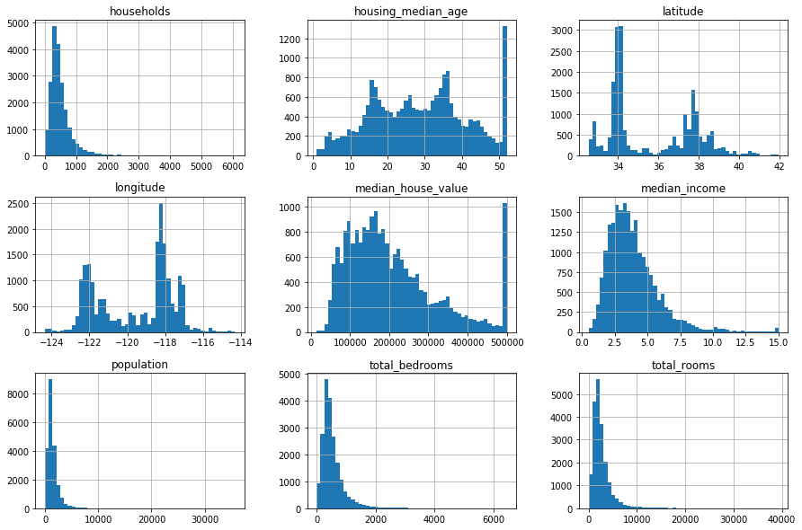


```python
import seaborn as sns
plt.figure(figsize=(6,4))
sns.distplot(dataset['median_house_value'])
plt.show()
```


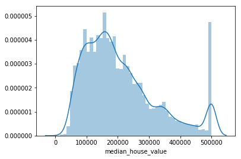


There is a strange pattern in the price frequency around 500000, which could be wrong data, so we can smooth it:


```python
dataset[dataset['median_house_value']>490000]['median_house_value'].value_counts().head()
```


    500001.0    965
    500000.0     27
    495500.0      3
    492500.0      2
    491200.0      2
    Name: median_house_value, dtype: int64


So we're going to remove values above 500000


```python
dataset=dataset.loc[dataset['median_house_value']<=500000,:]
```


```python
plt.figure(figsize=(10,5))
sns.distplot(dataset['median_house_value'])
plt.show()
```


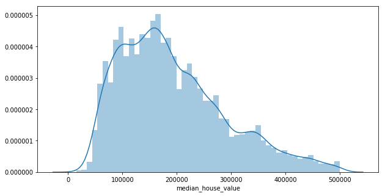


#### Plotting the Longitude and Latitude of each instance, with population density and price of the house

Each circle radius represents the district’s population (option s), and the color of each circle represents the price (option c). The color map 'jet' makes the lowest values appear as blue and the highest values red. We can see that there is a tendency of the prices to be higher near the ocean


```python
#plotting the latitude and longitude of each instance  with population density and price of the house
dataset.plot(kind="scatter", x="longitude", y="latitude", alpha=0.5, s=dataset["population"]/100, label="Population",
             figsize=(12,8), c="median_house_value", cmap=plt.get_cmap("jet"), colorbar=True, sharex=False)
plt.legend();
```


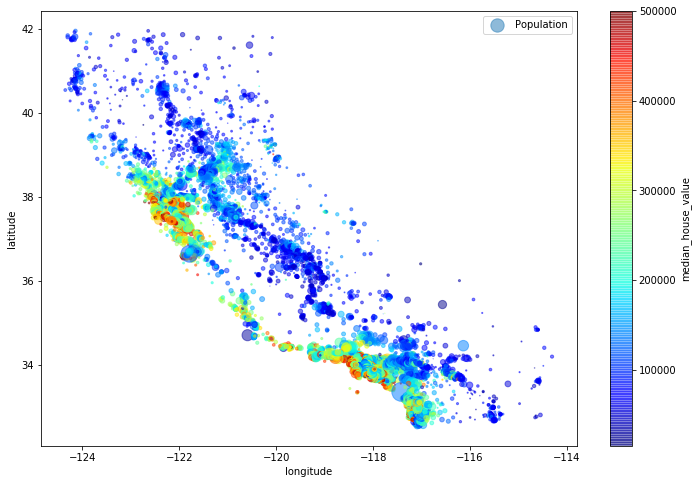


#### Looking for Correlations
We are going to predict the values of the houses in this model, so we can start by looking how the other attributes correlates with our label


```python
corr_matrix = dataset.corr()
corr_matrix["median_house_value"].sort_values(ascending=False)
```


    median_house_value    1.000000
    median_income         0.642611
    <1H OCEAN             0.284524
    NEAR BAY              0.157077
    total_rooms           0.143139
    NEAR OCEAN            0.135889
    households            0.094894
    total_bedrooms        0.074178
    housing_median_age    0.067948
    population            0.011964
    longitude            -0.046658
    latitude             -0.148289
    INLAND               -0.499008
    Name: median_house_value, dtype: float64


The most promising attributes to be correlated with "median_house_value" are: "median_income", "total_rooms", "households", so we can plot a scatter matrix to take a better look:


```python
from pandas.plotting import scatter_matrix

scatter_matrix(dataset[["median_house_value", "median_income", "total_rooms", "households"]], figsize=(15, 8));
```


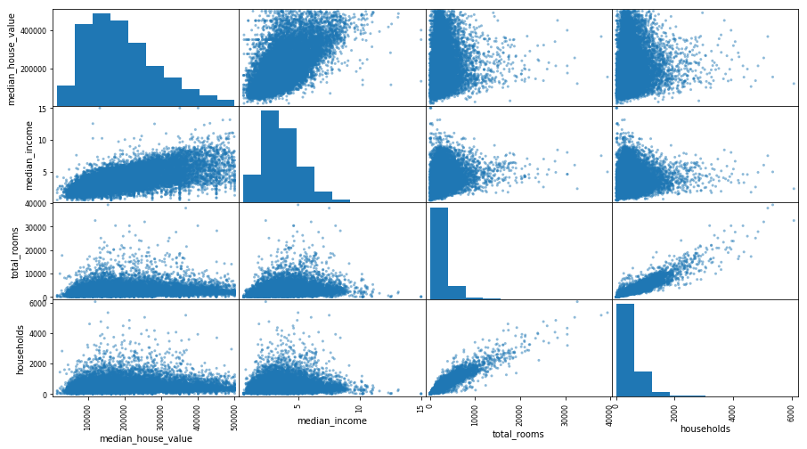


## 4. Combining attributes
We can transform some attributes so they can become more relevant to our analysis:

* the total number of rooms in a district is not very useful if you don’t know how many households there are, so it's more       interesting to have the **number of rooms per household**.

* The same goes for the total number of bedrooms, that by itself is not very useful, so we can compare it to the number of  rooms.

* Another one we can create is the **population per household**


```python
dataset["rooms_per_household"] = dataset["total_rooms"]/dataset["households"]
dataset["bedrooms_per_room"] = dataset["total_bedrooms"]/dataset["total_rooms"]
dataset["population_per_household"]=dataset["population"]/dataset["households"]
dataset.head()
```


<div>
<style scoped>
    .dataframe tbody tr th:only-of-type {
        vertical-align: middle;
    }

    .dataframe tbody tr th {
        vertical-align: top;
    }

    .dataframe thead th {
        text-align: right;
    }
</style>
<table border="1" class="dataframe">
  <thead>
    <tr style="text-align: right;">
      <th></th>
      <th>longitude</th>
      <th>latitude</th>
      <th>housing_median_age</th>
      <th>total_rooms</th>
      <th>total_bedrooms</th>
      <th>population</th>
      <th>households</th>
      <th>median_income</th>
      <th>median_house_value</th>
      <th>&lt;1H OCEAN</th>
      <th>INLAND</th>
      <th>NEAR BAY</th>
      <th>NEAR OCEAN</th>
      <th>rooms_per_household</th>
      <th>bedrooms_per_room</th>
      <th>population_per_household</th>
    </tr>
  </thead>
  <tbody>
    <tr>
      <th>0</th>
      <td>-122.23</td>
      <td>37.88</td>
      <td>41.0</td>
      <td>880.0</td>
      <td>129.0</td>
      <td>322.0</td>
      <td>126.0</td>
      <td>8.3252</td>
      <td>452600.0</td>
      <td>0.0</td>
      <td>0.0</td>
      <td>1.0</td>
      <td>0.0</td>
      <td>6.984127</td>
      <td>0.146591</td>
      <td>2.555556</td>
    </tr>
    <tr>
      <th>1</th>
      <td>-122.22</td>
      <td>37.86</td>
      <td>21.0</td>
      <td>7099.0</td>
      <td>1106.0</td>
      <td>2401.0</td>
      <td>1138.0</td>
      <td>8.3014</td>
      <td>358500.0</td>
      <td>0.0</td>
      <td>0.0</td>
      <td>1.0</td>
      <td>0.0</td>
      <td>6.238137</td>
      <td>0.155797</td>
      <td>2.109842</td>
    </tr>
    <tr>
      <th>2</th>
      <td>-122.24</td>
      <td>37.85</td>
      <td>52.0</td>
      <td>1467.0</td>
      <td>190.0</td>
      <td>496.0</td>
      <td>177.0</td>
      <td>7.2574</td>
      <td>352100.0</td>
      <td>0.0</td>
      <td>0.0</td>
      <td>1.0</td>
      <td>0.0</td>
      <td>8.288136</td>
      <td>0.129516</td>
      <td>2.802260</td>
    </tr>
    <tr>
      <th>3</th>
      <td>-122.25</td>
      <td>37.85</td>
      <td>52.0</td>
      <td>1274.0</td>
      <td>235.0</td>
      <td>558.0</td>
      <td>219.0</td>
      <td>5.6431</td>
      <td>341300.0</td>
      <td>0.0</td>
      <td>0.0</td>
      <td>1.0</td>
      <td>0.0</td>
      <td>5.817352</td>
      <td>0.184458</td>
      <td>2.547945</td>
    </tr>
    <tr>
      <th>4</th>
      <td>-122.25</td>
      <td>37.85</td>
      <td>52.0</td>
      <td>1627.0</td>
      <td>280.0</td>
      <td>565.0</td>
      <td>259.0</td>
      <td>3.8462</td>
      <td>342200.0</td>
      <td>0.0</td>
      <td>0.0</td>
      <td>1.0</td>
      <td>0.0</td>
      <td>6.281853</td>
      <td>0.172096</td>
      <td>2.181467</td>
    </tr>
  </tbody>
</table>
</div>


Let's see the correlation one more time:


```python
corr_matrix = dataset.corr()
corr_matrix["median_house_value"].sort_values(ascending=False)
```


    median_house_value          1.000000
    median_income               0.642611
    <1H OCEAN                   0.284524
    NEAR BAY                    0.157077
    total_rooms                 0.143139
    NEAR OCEAN                  0.135889
    rooms_per_household         0.109673
    households                  0.094894
    total_bedrooms              0.074178
    housing_median_age          0.067948
    population                  0.011964
    population_per_household   -0.021465
    longitude                  -0.046658
    latitude                   -0.148289
    bedrooms_per_room          -0.196226
    INLAND                     -0.499008
    Name: median_house_value, dtype: float64


With that we can see that our news attributes combinations have a higher correlation than their precessors

## 5. Modeling

Let's try the following algorithms: 
* Linear Regression
* Polynomial Regression
* Decision Tree
* Random Forest
* SVR

At each algorithm, the evaluation a metric is the $R^{2}$ score, which is metric that provides an indication of the goodness of a model prediction (coefficient of determination).
This score ranges between 0 for no-fit and 1 for a perfect fit.
A Comparison table is showed at the end. The other metrics such as **Mean Absolute Error** and **Mean Squared Error** can be easilly applied too.

**Splitting the dataset into training set and test set**


```python
#first we separate our labels from our attributes
X = dataset.drop('median_house_value', axis=1).values
y = dataset['median_house_value'].values
```


```python
from sklearn.model_selection import train_test_split

X_train, X_test, y_train, y_test = train_test_split(X, y, test_size = 0.2, random_state = 0)
```

**Feature Scaling**


```python
from sklearn.preprocessing import MinMaxScaler
scaler = MinMaxScaler()
X_train = scaler.fit_transform(X_train)
X_test = scaler.transform(X_test)
```

### 5.1 Linear Regression


```python
from sklearn.linear_model import LinearRegression
from sklearn.metrics import mean_squared_error
from sklearn.model_selection import cross_val_score
```


```python
#Fitting linear regression to the training set
from sklearn.linear_model import LinearRegression
regressor = LinearRegression()
regressor.fit(X_train, y_train)

#Predicting the test set results
y_pred = regressor.predict(X_test)
```


```python
#Performing Cross Validation Scoring
cross_val_lr = cross_val_score(cv = 10, X = X_train, y = y_train, estimator = regressor, scoring = 'r2')
r2_lr = cross_val_lr.mean()
std_lr = cross_val_lr.std()
print('R2 Score: ' + str(r2_lr))
print('Variance: ' + str(std_lr))
```

    R2 Score: 0.5921297862847359
    Variance: 0.06259298829994475
    

#### Taking only the 'median_income' in consideration (highest correlation)


```python
regressor.fit(X_train[:,[7]], y_train)
y_pred_med_inc = regressor.predict(X_test[:,[7]])

rmse_med_inc = np.sqrt(mean_squared_error(y_test , y_pred_med_inc))
cross_val__med_inc = cross_val_score(cv = 10,X = X_train[:,[7]], y = y_train, estimator = regressor, scoring = 'r2')

print('R2 Score: ' + str(cross_val__med_inc.mean()))
print('Variance: ' + str(cross_val__med_inc.std()))

plt.figure(figsize=(15,7))
plt.scatter(X_train[:,7], y_train, color="#3F5D7D", alpha = 0.2)
plt.plot(X_test[:,7], regressor.predict(X_test[:,7:8]), color ='red')
plt.xlabel('median income')
plt.ylabel('median house value')
plt.show()
```

    R2 Score: 0.417187870142447
    Variance: 0.015916603935884243
    


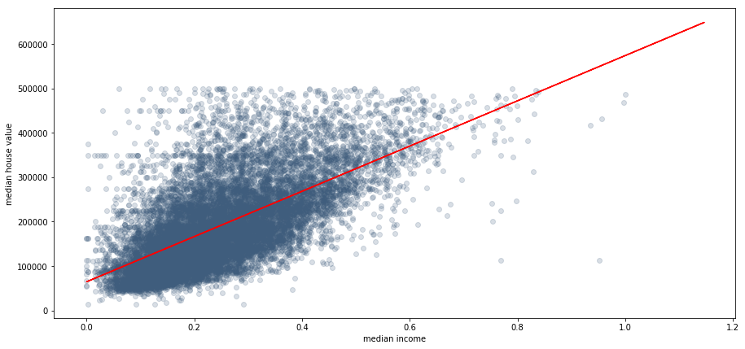


### 5.2 Polynomial Regression


```python
from sklearn.preprocessing import PolynomialFeatures

poly = PolynomialFeatures(degree = 3)
X_train_poly = poly.fit_transform(X_train)
X_test_poly = poly.fit_transform(X_test)

regressor_poly = LinearRegression()
regressor_poly.fit(X_train_poly, y_train)

#Predicting the test set results
y_pred_poly = regressor_poly.predict(X_test_poly)

#Performing Cross Validation Scoring
cross_val_poly = cross_val_score(cv = 10,X = X_train_poly, y = y_train, estimator = regressor_poly, scoring = 'r2')
print('R2 Score: ' + str(cross_val_poly.mean()))
print('Variance: ' + str(cross_val_poly.std()))

```

    R2 Score: -15133660498629.828
    Variance: 27602377719527.22
    

* The polynomial regression is suffering from very high variance when using all features to predict

#### Taking only the 'median_income' in consideration (highest correlation)


```python
poly = PolynomialFeatures(degree = 3, include_bias=False)
X_train_poly = poly.fit_transform(X_train[:,[7]])
X_test_poly = poly.fit_transform(X_test[:,[7]])

regressor_poly = LinearRegression()
regressor_poly.fit(X_train_poly, y_train)

#Predicting the test set results
y_pred_poly = regressor_poly.predict(X_test_poly)

#Performing Cross Validation Scoring
cross_val_poly = cross_val_score(cv = 10,X = X_train_poly, y = y_train, estimator = regressor_poly, scoring = 'r2')
print('R2 Score: ' + str(cross_val_poly.mean()))
print('Variance: ' + str(cross_val_poly.std()))

X_new = np.linspace(0, 1, 100).reshape(100, 1)
X_new_poly = poly.transform(X_new)
y_new = regressor_poly.predict(X_new_poly)

plt.figure(figsize=(15,7))
plt.scatter(X_train[:,7], y_train, color="#3F5D7D", alpha = 0.3)
plt.plot(X_new, y_new, "r-", linewidth=2, label="Predictions")
plt.xlabel('median income')
plt.ylabel('median house value')
plt.show()
```

    R2 Score: 0.4194276600974719
    Variance: 0.014415397446401907
    


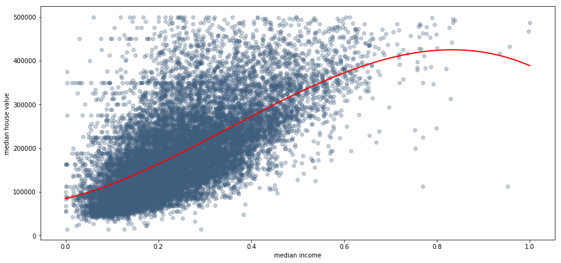


* Using only the median_income we have a much better result, but the linear regression went better

### 5.3 Decision Tree


```python
from sklearn.tree import DecisionTreeRegressor

dec_tree = DecisionTreeRegressor(random_state=42, min_samples_leaf=25)
dec_tree_2 = DecisionTreeRegressor(random_state=42, min_samples_leaf=25)
dec_tree.fit(X_train, y_train)
dec_tree_2.fit(X_train[:,[7]], y_train)

y_pred_dec_tree = dec_tree.predict(X_test)

#Performing Cross Validation Scoring
cross_val_dec_tree = cross_val_score(cv = 10,X = X_train, y = y_train, estimator = dec_tree, scoring = 'r2')
print('R2 Score: ' + str(cross_val_dec_tree.mean()))
print('Variance: ' + str(cross_val_dec_tree.std()))

x1 = np.linspace(0, 1, 500).reshape(-1, 1)
y_1 = dec_tree_2.predict(x1)

plt.figure(figsize=(15,7))
plt.scatter(X_train[:,7], y_train, color="#3F5D7D", alpha = 0.3)
plt.plot(x1, y_1, color ='red',  )

plt.xlabel('median income')
plt.ylabel('median house value')
plt.show()
```

    R2 Score: 0.7060781113904006
    Variance: 0.01270432695883905
    


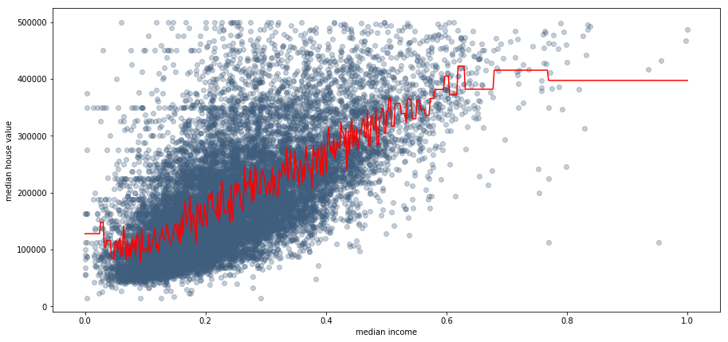


### 5.4 Random Forest


```python
from sklearn.ensemble import RandomForestRegressor

#Performing grid search to find best parameters
from sklearn.model_selection import GridSearchCV

param_grid = [
    # try 12 (3×4) combinations of hyperparameters
    {'n_estimators': [3, 10, 30, 90, 180], 'max_features': [2, 4, 6, 8]},
    # then try 6 (2×3) combinations with bootstrap set as False
    #{'bootstrap': [False], 'n_estimators': [3, 10], 'max_features': [2, 3, 4]},
  ]

forest_reg = RandomForestRegressor(random_state=42)

grid_search = GridSearchCV(forest_reg, param_grid, cv=5, scoring='neg_mean_squared_error', return_train_score=True)
grid_search.fit(X_train, y_train);
```


```python
grid_search.best_params_
```


    {'max_features': 6, 'n_estimators': 180}


```python
forest_reg = RandomForestRegressor(max_features = 6, n_estimators=180, random_state=42)
forest_reg.fit(X_train, y_train)
y_pred_forest_reg = forest_reg.predict(X_test)

#Performing Cross Validation Scoring
cross_val_forest_reg = cross_val_score(cv = 10,X = X_train, y = y_train, estimator = forest_reg, scoring = 'r2')
print('R2 Score: ' + str(cross_val_forest_reg.mean()))
print('Variance: ' + str(cross_val_forest_reg.std()))
```

    R2 Score: 0.7920768324032593
    Variance: 0.01107013995292256
    

#### Taking only the 'median_income' in consideration (highest correlation)


```python
forest_reg = RandomForestRegressor(n_estimators=30, random_state=42)
forest_reg.fit(X_train[:,[7]], y_train)
y_pred_forest_reg = forest_reg.predict(X_test[:,[7]])

#Performing Cross Validation Scoring
cross_val_forest_reg = cross_val_score(cv = 10,X = X_train, y = y_train, estimator = forest_reg, scoring = 'r2')
print('R2 Score: ' + str(cross_val_dec_tree.mean()))
print('Variance: ' + str(cross_val_dec_tree.std()))

x1 = np.linspace(0, 1, 500).reshape(-1, 1)
y_1 = forest_reg.predict(x1)

plt.figure(figsize=(15,7))
plt.scatter(X_test[:,7], y_test, color="#3F5D7D", alpha = 0.3)
plt.plot(x1, y_1, color ='red',linewidth=0.8)

plt.xlabel('median income')
plt.ylabel('median house value')
plt.show()
```

    R2 Score: 0.7060781113904006
    Variance: 0.01270432695883905
    


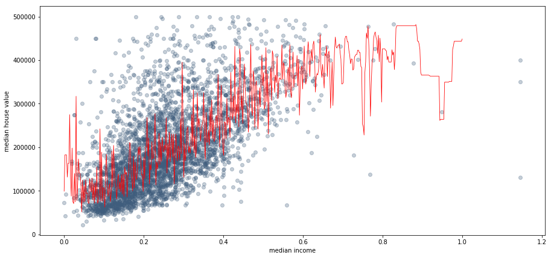


It's noticeable that the random forest regressor overfitted when using only one attribute, but this plot is interesting to visualize how the algorithm behaves.

### 5.5 SVR


```python
from sklearn.svm import SVR

param_grid = [
    {'kernel': ['linear','rbf'], 'C': [100, 1000, 10000, 100000, 150000, 200000], 'gamma':[0.15, 0.2, 0.25, 0.3, 0.35] }
      ]

svm_reg = SVR()

grid_search = GridSearchCV(svm_reg, param_grid, cv=5, scoring='r2', return_train_score=True)
grid_search.fit(X_train, y_train);
```


    "\nparam_distribs = {\n        'kernel': ['rbf'],\n        'C': reciprocal(100000, 200000),\n        'gamma': [0.15, 0.2, 0.25, 0.3, 0.35],\n    }\n\nsvm_reg = SVR()\nrnd_search = RandomizedSearchCV(svm_reg, param_distributions=param_distribs,\n                                n_iter=50, cv=5, scoring='neg_mean_squared_error',\n                                verbose=2, n_jobs=4, random_state=42)\nrnd_search.fit(X_train, y_train)\n\n\nnegative_mse_svr = rnd_search.best_score_\nrmse_svr = np.sqrt(-negative_mse_svr)\n\nprint(rmse_svr)\n\nprint(rnd_search.best_params_)\n"


```python
grid_search.best_params_
```


    {'C': 200000, 'gamma': 0.35, 'kernel': 'rbf'}


```python
svm_reg = SVR(kernel = "rbf", C = 400000, epsilon = 2, gamma = 0.7)
svm_reg.fit(X_train, y_train)

y_pred_svr = svm_reg.predict(X_test)

#Performing Cross Validation Scoring
cross_val_svm_reg = cross_val_score(cv = 10,X = X_train, y = y_train, estimator = svm_reg, scoring = 'r2')
print('R2 Score: ' + str(cross_val_svm_reg.mean()))
print('Variance: ' + str(cross_val_svm_reg.std()))


svm_mse = mean_squared_error(y_test, y_pred_svr)
svm_rmse = np.sqrt(svm_mse)
svm_rmse
```

    R2 Score: 0.6846528553347955
    Variance: 0.012282710701498762
    


    56190.55401762277


```python
svm_reg = SVR(kernel="rbf", C=400000, epsilon=2, gamma = 0.7)
svm_reg.fit(X_train[:,[7]], y_train)

y_pred_svr = svm_reg.predict(X_test[:,[7]])

#Performing Cross Validation Scoring
cross_val_svm_reg = cross_val_score(cv = 10,X = X_train[:,[7]], y = y_train, estimator = svm_reg, scoring = 'r2')
print('R2 Score: ' + str(cross_val_svm_reg.mean()))
print('Variance: ' + str(cross_val_svm_reg.std()))


x1 = np.linspace(0, 1, 500).reshape(-1, 1)
y_1 = svm_reg.predict(x1)

plt.figure(figsize=(15,7))
plt.scatter(X_test[:,7], y_test, color="#3F5D7D", alpha = 0.3)
plt.plot(x1, y_1, color ='red',linewidth=0.8)

plt.xlabel('median income')
plt.ylabel('median house value')
plt.show()
```

    R2 Score: 0.39727593390330307
    Variance: 0.019909481524306993
    


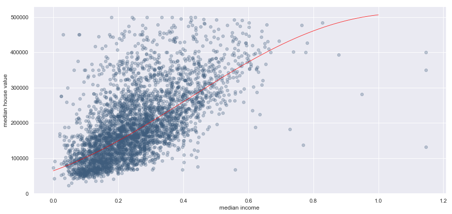


## 6. Models Comparison

Here are the scores from each algorithm again:


```python
d = {'Linear Reg': [r2_lr, std_lr],
    'Polynomial Reg': [cross_val_poly.mean(), cross_val_poly.std()],
    'Decision Tree Reg': [cross_val_dec_tree.mean(), cross_val_dec_tree.std()],
    'Random Forest Reg': [cross_val_forest_reg.mean(), cross_val_forest_reg.std()],
    'SVR': [cross_val_svm_reg.mean(), cross_val_svm_reg.std()]
    }
scores = pd.DataFrame(d, index = ['R2 Score', 'Std'])
scores
```


<div>
<style scoped>
    .dataframe tbody tr th:only-of-type {
        vertical-align: middle;
    }

    .dataframe tbody tr th {
        vertical-align: top;
    }

    .dataframe thead th {
        text-align: right;
    }
</style>
<table border="1" class="dataframe">
  <thead>
    <tr style="text-align: right;">
      <th></th>
      <th>Linear Reg</th>
      <th>Polynomial Reg</th>
      <th>Decision Tree Reg</th>
      <th>Random Forest Reg</th>
      <th>SVR</th>
    </tr>
  </thead>
  <tbody>
    <tr>
      <th>R2 Score</th>
      <td>0.592130</td>
      <td>0.419428</td>
      <td>0.419508</td>
      <td>0.792077</td>
      <td>0.684653</td>
    </tr>
    <tr>
      <th>Std</th>
      <td>0.062593</td>
      <td>0.014415</td>
      <td>0.018188</td>
      <td>0.011070</td>
      <td>0.012283</td>
    </tr>
  </tbody>
</table>
</div>


```python
sns.set()
my_colors = ['r', 'g', 'b', 'k', 'y', 'm', 'c'] 
scores.sort_values('R2 Score', ascending=False, inplace = True, axis = 1)
scores.loc['R2 Score',:].plot(
    kind = 'bar', 
    color = my_colors,
    figsize=(12,8),
    
    )
plt.xticks(rotation=0)
plt.title('R2 Scores from Algorithms')
plt.show()
```


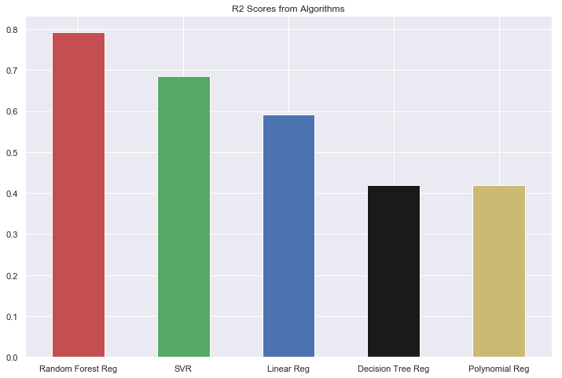


With a R2 Score of 0.792077, the best model found here was the Random Forest Regression using 6 features 180 estimators. 
