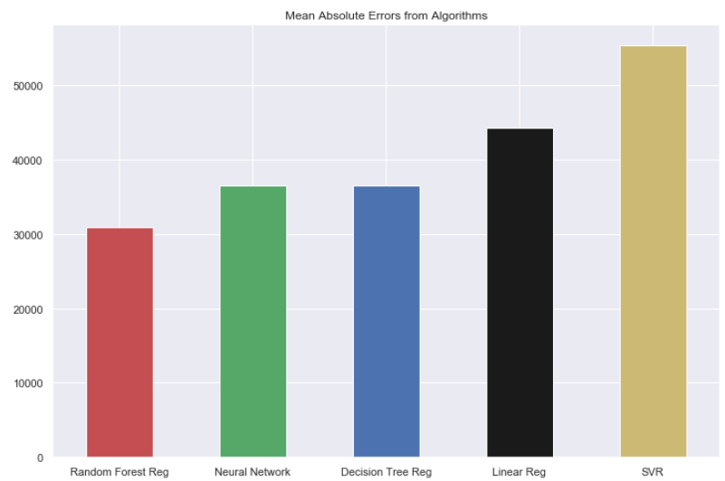

## California House Pricing

This dataset contains data from a 1990 census date in a California district, and the goal is to use regression algorithms to predict the price of a house based on 9 features. The algorithms used in the score benchmarking were:

* Neural Network
* Linear Regression
* Polynomial Regression
* Decision Tree
* Random Forest
* SVR

Their score comparison can be seen on Fig 1:

<a>
    

        

            
            <h5 style="color:black;" align="middle">Figure 1 - Score comparison from the regression algorithms</h5>
        

    

</a>

With a MAE of 29963, the best model found here was the Random Forest Regression using 6 features 180 estimators. Considering the price goes from 15000 to 500000, giving a range of 485000, a mean absolute error of 29963 seems reasonable.
**All the code and complete analysis can be seen on the Jupyter notebook in the dataset's folder.**
