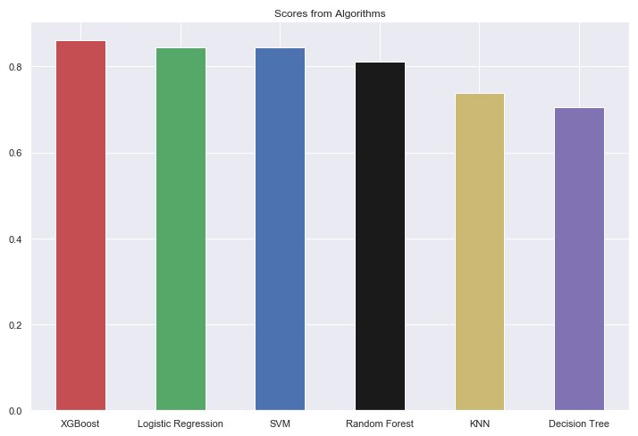

# Datasets Analyzed

Here are the datasets analyzed so far along with their main results:

## Loan Prediction

<a>
    

        

            
        

    

</a>

The goal on this dataset was to use classification algorithms to predict if an applicant would get his loan approved or not based on 12 features. The algorithms used in the score benchmarking were:

* Logistic Regression
* SVM
* KNN
* Decision Tree
* Random Forest
* XGBoost

Their score comparison can be seen on Fig 1:

<a>
    

        

            
            <h5 style="color:black;" align="middle">Figure 1 - Score comparison from the classification algorithms</h5>
        

    

</a>

With a Score of 0.860656, the best model found here was the XGBoost using 45 estimators with a max depth of 4.
**All the code and complete analysis can be seen on the Jupyter notebook in the dataset's folder.**
