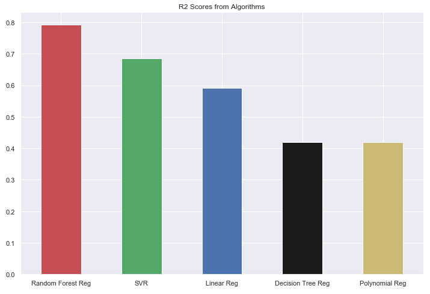

# Datasets Analyzed

Here are the datasets analyzed so far along with their main results:

## Loan Prediction

<a>
    

        

            
        

    

</a>

The goal on this dataset was to use classification algorithms to predict if an applicant would get his loan approved or not based on 12 features. The algorithms used in the score benchmarking were:

* Logistic Regression
* SVM
* KNN
* Decision Tree
* Random Forest
* XGBoost

Their score comparison can be seen on Fig 1:

<a>
    

        

            
            <h5 style="color:black;" align="middle">Figure 1 - Score comparison from the classification algorithms</h5>
        

    

</a>

With a Score of 0.860656, the best model found here was the XGBoost using 45 estimators with a max depth of 4.
**All the code and complete analysis can be seen on the Jupyter notebook in the dataset's folder.**

## California House Pricing

<a>
    

        

            
        

    

</a>

This dataset contains data from a 1990 census date in a California district, and the goal is to use regression algorithms to predict the price of a house based on 9 features. The algorithms used in the score benchmarking were:

* Linear Regression
* Polynomial Regression
* Decision Tree
* Random Forest
* SVR

Their score comparison can be seen on Fig 2:

<a>
    

        

            
            <h5 style="color:black;" align="middle">Figure 2 - Score comparison from the regression algorithms</h5>
        

    

</a>

With a R2 Score of 0.792077, the best model found here was the Random Forest Regression using 6 features 180 estimators.
**All the code and complete analysis can be seen on the Jupyter notebook in the dataset's folder.**
