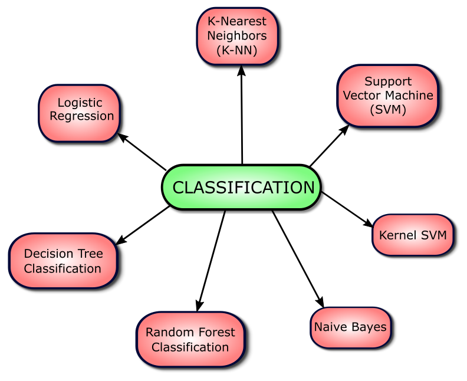
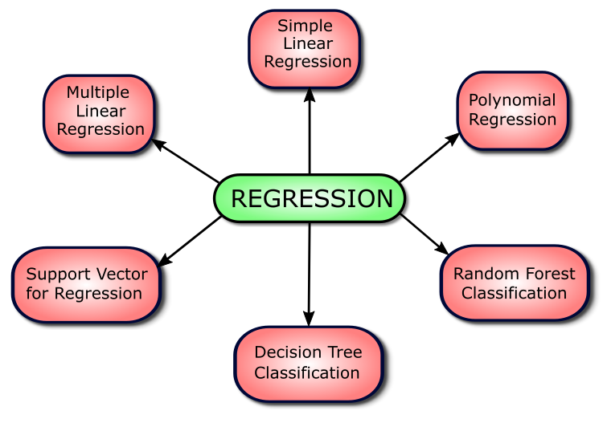
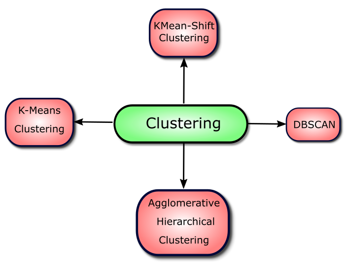

# Machine-Learning

Here I share some Datasets analysis where I applied different algorithms, tools and concepts such as seen on Figs 1, 2 and 3:

  

    
    <h5 style="color:black;" align="left">Figure 1 - Most commom Classifcation Algorithms</h5>
  

  

    
    <h5 style="color:black;" align="right">Figure 2 - Most commom Regression Algorithms</h5>
  

<a>
    

        

            
            <h5 style="color:black;" align="middle">Figure 3 - Most commom Clustering Algorithms</h5>
        

    

</a>
