# Student Loan Approval


```python
import pandas as pd
import numpy as np
import matplotlib.pyplot as plt
import seaborn as sns 
%matplotlib inline
sns.set()
# To ignore any warnings 
import warnings
warnings.filterwarnings("ignore")
```


```python
train = pd.read_csv('train.csv')
test = pd.read_csv('test.csv')

#making a copy of train and test data
train_original = train.copy() 
test_original = test.copy()
```

### Exploring variables


```python
train.head()
```


<div>
<style scoped>
    .dataframe tbody tr th:only-of-type {
        vertical-align: middle;
    }

    .dataframe tbody tr th {
        vertical-align: top;
    }

    .dataframe thead th {
        text-align: right;
    }
</style>
<table border="1" class="dataframe">
  <thead>
    <tr style="text-align: right;">
      <th></th>
      <th>Loan_ID</th>
      <th>Gender</th>
      <th>Married</th>
      <th>Dependents</th>
      <th>Education</th>
      <th>Self_Employed</th>
      <th>ApplicantIncome</th>
      <th>CoapplicantIncome</th>
      <th>LoanAmount</th>
      <th>Loan_Amount_Term</th>
      <th>Credit_History</th>
      <th>Property_Area</th>
      <th>Loan_Status</th>
    </tr>
  </thead>
  <tbody>
    <tr>
      <th>0</th>
      <td>LP001002</td>
      <td>Male</td>
      <td>No</td>
      <td>0</td>
      <td>Graduate</td>
      <td>No</td>
      <td>5849</td>
      <td>0.0</td>
      <td>NaN</td>
      <td>360.0</td>
      <td>1.0</td>
      <td>Urban</td>
      <td>Y</td>
    </tr>
    <tr>
      <th>1</th>
      <td>LP001003</td>
      <td>Male</td>
      <td>Yes</td>
      <td>1</td>
      <td>Graduate</td>
      <td>No</td>
      <td>4583</td>
      <td>1508.0</td>
      <td>128.0</td>
      <td>360.0</td>
      <td>1.0</td>
      <td>Rural</td>
      <td>N</td>
    </tr>
    <tr>
      <th>2</th>
      <td>LP001005</td>
      <td>Male</td>
      <td>Yes</td>
      <td>0</td>
      <td>Graduate</td>
      <td>Yes</td>
      <td>3000</td>
      <td>0.0</td>
      <td>66.0</td>
      <td>360.0</td>
      <td>1.0</td>
      <td>Urban</td>
      <td>Y</td>
    </tr>
    <tr>
      <th>3</th>
      <td>LP001006</td>
      <td>Male</td>
      <td>Yes</td>
      <td>0</td>
      <td>Not Graduate</td>
      <td>No</td>
      <td>2583</td>
      <td>2358.0</td>
      <td>120.0</td>
      <td>360.0</td>
      <td>1.0</td>
      <td>Urban</td>
      <td>Y</td>
    </tr>
    <tr>
      <th>4</th>
      <td>LP001008</td>
      <td>Male</td>
      <td>No</td>
      <td>0</td>
      <td>Graduate</td>
      <td>No</td>
      <td>6000</td>
      <td>0.0</td>
      <td>141.0</td>
      <td>360.0</td>
      <td>1.0</td>
      <td>Urban</td>
      <td>Y</td>
    </tr>
  </tbody>
</table>
</div>


```python
test.head()
```


<div>
<style scoped>
    .dataframe tbody tr th:only-of-type {
        vertical-align: middle;
    }

    .dataframe tbody tr th {
        vertical-align: top;
    }

    .dataframe thead th {
        text-align: right;
    }
</style>
<table border="1" class="dataframe">
  <thead>
    <tr style="text-align: right;">
      <th></th>
      <th>Loan_ID</th>
      <th>Gender</th>
      <th>Married</th>
      <th>Dependents</th>
      <th>Education</th>
      <th>Self_Employed</th>
      <th>ApplicantIncome</th>
      <th>CoapplicantIncome</th>
      <th>LoanAmount</th>
      <th>Loan_Amount_Term</th>
      <th>Credit_History</th>
      <th>Property_Area</th>
    </tr>
  </thead>
  <tbody>
    <tr>
      <th>0</th>
      <td>LP001015</td>
      <td>Male</td>
      <td>Yes</td>
      <td>0</td>
      <td>Graduate</td>
      <td>No</td>
      <td>5720</td>
      <td>0</td>
      <td>110.0</td>
      <td>360.0</td>
      <td>1.0</td>
      <td>Urban</td>
    </tr>
    <tr>
      <th>1</th>
      <td>LP001022</td>
      <td>Male</td>
      <td>Yes</td>
      <td>1</td>
      <td>Graduate</td>
      <td>No</td>
      <td>3076</td>
      <td>1500</td>
      <td>126.0</td>
      <td>360.0</td>
      <td>1.0</td>
      <td>Urban</td>
    </tr>
    <tr>
      <th>2</th>
      <td>LP001031</td>
      <td>Male</td>
      <td>Yes</td>
      <td>2</td>
      <td>Graduate</td>
      <td>No</td>
      <td>5000</td>
      <td>1800</td>
      <td>208.0</td>
      <td>360.0</td>
      <td>1.0</td>
      <td>Urban</td>
    </tr>
    <tr>
      <th>3</th>
      <td>LP001035</td>
      <td>Male</td>
      <td>Yes</td>
      <td>2</td>
      <td>Graduate</td>
      <td>No</td>
      <td>2340</td>
      <td>2546</td>
      <td>100.0</td>
      <td>360.0</td>
      <td>NaN</td>
      <td>Urban</td>
    </tr>
    <tr>
      <th>4</th>
      <td>LP001051</td>
      <td>Male</td>
      <td>No</td>
      <td>0</td>
      <td>Not Graduate</td>
      <td>No</td>
      <td>3276</td>
      <td>0</td>
      <td>78.0</td>
      <td>360.0</td>
      <td>1.0</td>
      <td>Urban</td>
    </tr>
  </tbody>
</table>
</div>


```python
train.shape, test.shape
```


    ((614, 13), (367, 12))


## Variables description:

**Categorical features**:

* **Loan_ID**:	              Unique Loan ID
* **Gender**:	              Male/ Female
* **Married**:	              Applicant married (Y/N)
* **Self_Employed**:	      Self employed (Y/N)
* **Credit_History**:	      Credit history meets guidelines (1 or 0, which is "yes" or "no" after being encoded)
* **Loan_Status**:	          Loan approved (Y/N)    


**Ordinal features**:

* **Dependents**:	          Number of dependents
* **Education**:	          Applicant Education (Graduate/ Under Graduate)
* **Property_Area**:	      Urban/ Semi Urban/ Rural

**Numerical features**:

* **ApplicantIncome**:	      Applicant income
* **CoapplicantIncome**:	  Coapplicant income
* **LoanAmount**:	          Loan amount in thousands
* **Loan_Amount_Term**:	      Term of loan in months

The Target Variable, which is the one being predicted is the **Loan_Status** and it's present only in the train set.

#### Checking for missing values in the dataset


```python
train.isnull().sum()
```


    Loan_ID               0
    Gender               13
    Married               3
    Dependents           15
    Education             0
    Self_Employed        32
    ApplicantIncome       0
    CoapplicantIncome     0
    LoanAmount           22
    Loan_Amount_Term     14
    Credit_History       50
    Property_Area         0
    Loan_Status           0
    dtype: int64


A good way to take care of those missing numerical values is by replacing them with them **median** from that feature, and for categorial variables the **mode** is most often used, which will be done after first initial visualizations.

### Univariate Analysis


Doing univariate analysis is the simplest form of analyzing data where each variable is examined individually. For categorical features the frequency table or bar plots shows the numbers of each category in a particular variable. For numerical features, probability density plots can be used to look at the distribution of the variable.

* **Target Variable** : As it is a categorical variable, the frequency table, percentage distribution and bar plot should be enough to understand it better. The Frequency table of a variable will give us the count of each category in that variable.


```python
train['Loan_Status'].value_counts().plot.bar();
```


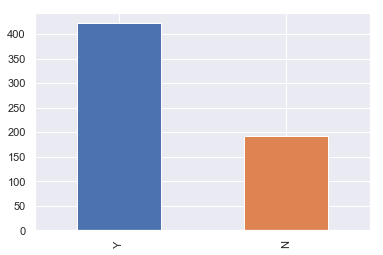


```python
# Setting the parameter Normalize to True can be used to print proportions instead of number 
print(train['Loan_Status'].value_counts(normalize=True))
```

    Y    0.687296
    N    0.312704
    Name: Loan_Status, dtype: float64
    

#### Categorical Features


```python
#Plotting proportions of categories in each variable
plt.subplot(221) 
train['Gender'].value_counts(normalize=True).plot.bar(figsize=(12,10), title= 'Gender') 
plt.subplot(222) 
train['Married'].value_counts(normalize=True).plot.bar(title= 'Married') 
plt.subplot(223) 
train['Self_Employed'].value_counts(normalize=True).plot.bar(title= 'Self_Employed') 
plt.subplot(224) 
train['Credit_History'].value_counts(normalize=True).plot.bar(title= 'Credit_History') 
plt.show()
```


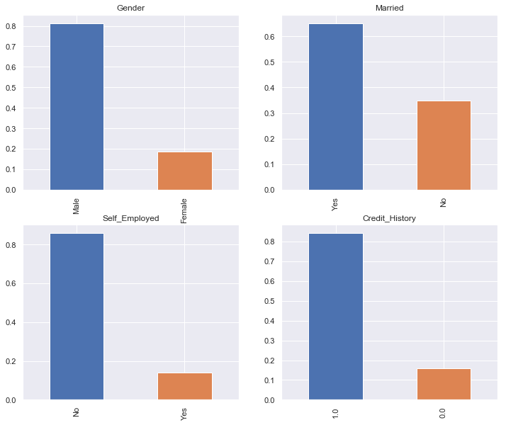


From these bar plots can be seen that:

* ~ 80% applicants in the dataset are male.
* ~ 65% of the applicants in the dataset are married.
* ~ 15% applicants in the dataset are self employed.
* ~ 85% applicants have repaid their debts.

#### Ordinal Features


```python
#Plotting proportions of categories in each variable
plt.subplot(131) 
train['Dependents'].value_counts(normalize=True).plot.bar(figsize=(15,6), title= 'Dependents') 
plt.subplot(132) 
train['Education'].value_counts(normalize=True).plot.bar(title= 'Education') 
plt.subplot(133) 
train['Property_Area'].value_counts(normalize=True).plot.bar(title= 'Property_Area') 
plt.show()
```


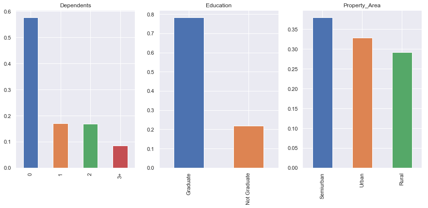


From these bar plots can be seen that:

* The majority of the applicants have no dependents.
* ~ 80% of the applicants are Graduate.
* The majority of the applicants are from Semiurban area.

#### Numerical Features

 * **Visualizing the applicant income distribution.**


```python
plt.subplot(121) 
sns.distplot(train['ApplicantIncome']);
plt.xlabel('Applicant Income ($k)')
plt.title('')
plt.subplot(122) 
train['ApplicantIncome'].plot.box(figsize=(16,5)) 
plt.show()
```


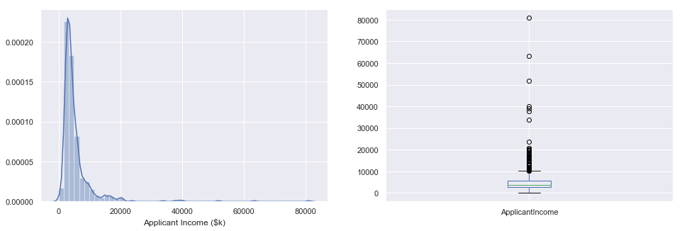


* In the density plot and Histogram on the left, can be seen that the applicant income distribution is towarded left, meaning    that it's not normally distributed. 
* The boxplot on the right shows a lot of outliers, which could be due to the economic inequality in society. A cause for this inequality could come from different education levels:


```python
train.boxplot(column='ApplicantIncome', by = 'Education')
plt.title("");
```


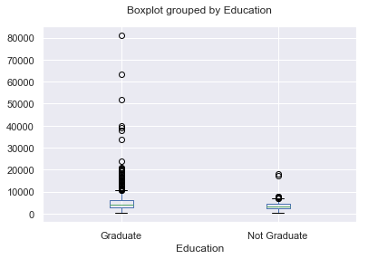


This boxplot confirms that the number of graduates with very high incomes is higher than not graduates, but the median income of graduate and non-graduates, so they can be considered outliers.

 * **Visualizing the Coapplicant income distribution.**


```python
plt.subplot(121) 
sns.distplot(train['CoapplicantIncome']); 
plt.subplot(122) 
train['CoapplicantIncome'].plot.box(figsize=(12,5)) 
plt.show()
```


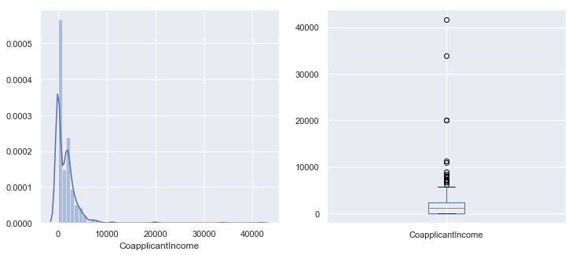


This variable also has a lot of outliers 

 * **Visualizing the Loan Amount distribution.**


```python
#Replacing missing values in variable with median
train['LoanAmount'].fillna(train['LoanAmount'].median(), inplace=True)
```


```python
plt.subplot(121) 
sns.distplot(train['LoanAmount']); 
plt.subplot(122) 
train['LoanAmount'].plot.box(figsize=(12,5)) 
plt.show()
print('Mean loan amount: ' + str(train['LoanAmount'].mean()) + ' k$')
```


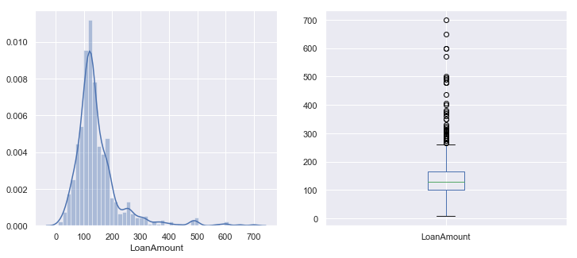


    Mean loan amount: 145.75244299674267 k$
    

 * **Visualizing the term of loan in months distribution.**


```python
plt.subplot(121) 
sns.distplot(train['Loan_Amount_Term']); 
plt.subplot(122) 
train['Loan_Amount_Term'].plot.box(figsize=(12,5)) 
plt.show()
print('Mean of months: ' + str(train['Loan_Amount_Term'].mean()))
```


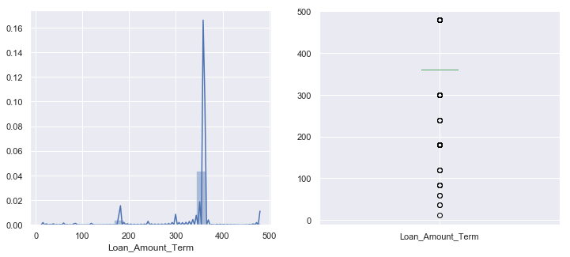


    Mean of months: 342.0
    

## Bivariate Analysis

First, some hypothesis can be made out of the variables:
* Higher income Applicants should have more loan approval chances.
* Positive record, which is, Applicants who have paid their previous debts should have higher chances of loan approval.
* Loan approval should also depend on the loan amount, with low loan amount getting higher loan approval.
* The chances for loan approval are higher for loans that are paid low amounts monthly

Visualizing categorical independent variables versus the dependent target varialbe with stacked bar plot:

### Categorical features vs Loan Approval


```python
Gender = pd.crosstab(train['Gender'], train['Loan_Status']) 
Married = pd.crosstab(train['Married'], train['Loan_Status']) 
Self_Employed = pd.crosstab(train['Self_Employed'], train['Loan_Status'])
Credit_History = pd.crosstab(train['Credit_History'], train['Loan_Status']) 

#defining 1 row and 3 columns
fig, axes = plt.subplots(1, 4, figsize =(10,4), sharey = True)

Gender.div(Gender.sum(1).astype(float), axis=0).plot(kind = "bar", ax = axes[0], stacked=True)
Married.div(Married.sum(1).astype(float), axis=0).plot(kind="bar", ax = axes[1], stacked=True)
Self_Employed.div(Self_Employed.sum(1).astype(float), axis=0).plot(kind = "bar",ax = axes[2], stacked=True)
Credit_History.div(Credit_History.sum(1).astype(float), axis=0).plot(kind="bar",ax=axes[3], stacked=True, figsize=(15,4)) ;
```


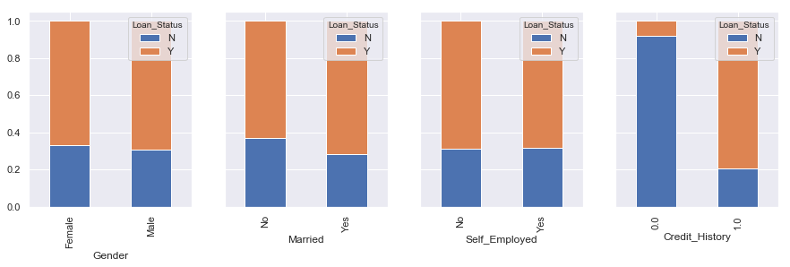


From this comparison it can be seen that:

* It can be seen the proportion from male and female that got their loans approved is almost the same.
* The married applicants get more loans approved comparing to single applicants.
* The Self Employed vs Loan_Status plot doesn't help much because it has the same proportion to classes.
* Applicants that have credit history as 1 are much more likely to get their loans approved.

### Ordinal Features vs Loan Status


```python
Property_Area = pd.crosstab(train['Property_Area'], train['Loan_Status']) 
Dependents = pd.crosstab(train['Dependents'], train['Loan_Status']) 
Education = pd.crosstab(train['Education'], train['Loan_Status']) 

#defining 1 row and 3 columns
fig, axes = plt.subplots(1, 3, figsize = (15, 4), sharey=True)

Education.div(Education.sum(1).astype(float), axis=0).plot(kind = "bar", ax = axes[0], stacked=True) 
Property_Area.div(Property_Area.sum(1).astype(float), axis=0).plot(kind = "bar", ax = axes[1], stacked = True)
Dependents.div(Dependents.sum(1).astype(float), axis=0).plot(kind = "bar", ax = axes[2], stacked = True);
```


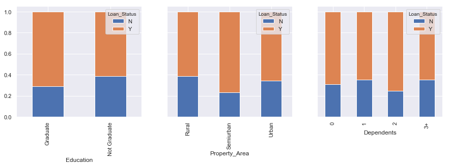


From this comparison it can be seen that:

* Graduate applicants have a higher approval rate than non-graduates.
* Proportion of loans getting approved in semiurban area is higher as compared to that in rural or urban areas.
* The distribution of applicants approval vs dependents number is in general similar.

### Numerical Features vs Loan Status


```python
#Comparing Loan Status to mean income
train.groupby('Loan_Status')['ApplicantIncome'].mean().plot.bar();
```


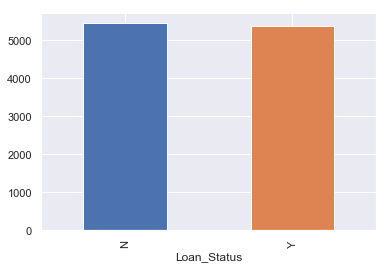


There's nothing much to take from the mean comparison, so it's interesting to split the applicant income in some range categories to observe this tendency better.


```python
bins = [0, 2000,4000,6000,80000] 
group=['Low income','Average income','High Income', 'Very high Income'] 
train['Income_bin'] = pd.cut(train['ApplicantIncome'], bins, labels = group)

Income_bin = pd.crosstab(train['Income_bin'], train['Loan_Status']) 
Income_bin.div(Income_bin.sum(1).astype(float), axis=0).plot(kind="bar", stacked=True, figsize = (8,4)) 
plt.title('Applicant Income sets') 
plt.xlabel('') 
plt.ylabel('Percentage')
plt.xticks(rotation=0);
```


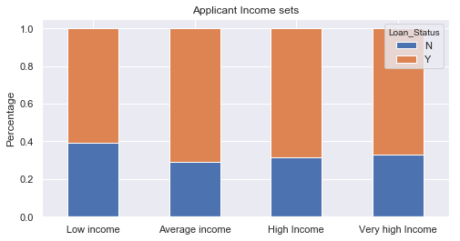


This plot already shows that Low income applicants receive less loan approvals, but it's interesting to do the same analysis for the Coapplicants too.


```python
bins = [0,1000,5000,40000] 
group_co = ['Low','Average','High']
train['coapplicant_income_bin'] = pd.cut(train['CoapplicantIncome'], bins, labels = group_co)

coapplicant_income_bin = pd.crosstab(train['coapplicant_income_bin'], train['Loan_Status']) 
coapplicant_income_bin.div(coapplicant_income_bin.sum(1).astype(float), axis=0).plot(kind="bar", stacked=True, figsize = (8,4)) 
plt.title('Coapplicants Income sets') 
plt.xlabel('') 
plt.ylabel('Percentage')
plt.xticks(rotation=0);
```


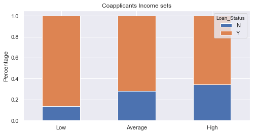


From this plot it can be understood that if coapplicant's income is low, then the chances of loan approval are high, which is strange. A possible reason for this may be the fact the majority of the applicants don’t have any coapplicant, so the coapplicant income for those applicants is 0. Considering this, the coapplicat income alone is not much useful in the analysis, so a good idea is to combine the applicant income with the coapplicant income to form a new variable, and then visualize the combined effect of income on loan approval.


```python
train['Total_Income'] = train['ApplicantIncome']+train['CoapplicantIncome']

bins = [0, 2000,4000,6000,80000] 
group=['Low','Average','High', 'Very high'] 

train['Total_Income_bin']=pd.cut(train['Total_Income'],bins,labels=group)
Total_Income_bin=pd.crosstab(train['Total_Income_bin'],train['Loan_Status']) 

Total_Income_bin.div(Total_Income_bin.sum(1).astype(float), axis=0).plot(kind="bar", stacked=True)
plt.title('Total Income') 
plt.xlabel('') 
plt.ylabel('Percentage')
plt.xticks(rotation=0);
```


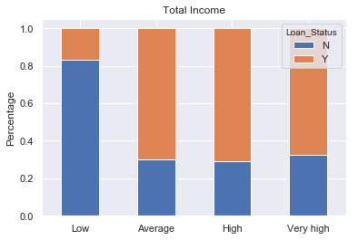


The Proportion of loans approved for applicants having low Total Income is way lower now than before, compared to applicants with Higher Income.

Lastly, it's useful to have a look at the **loan amount** against **loan approval** plot:


```python
#from the loan ammount distribution plot, 
bins = [0,80,200,600]
group = ['Low','Average','High']
train['LoanAmount_bin'] = pd.cut(train['LoanAmount'], bins, labels = group)

LoanAmount_bin = pd.crosstab(train['LoanAmount_bin'], train['Loan_Status']) 
LoanAmount_bin.div(LoanAmount_bin.sum(1).astype(float), axis=0).plot(kind="bar", stacked=True) 
plt.title('Loan Amount')
plt.xlabel('')
plt.ylabel('Percentage')
plt.xticks(rotation = 0);
```


The hypothesis that loans have a higher approval chance for low loan ammount and lower approval chances for high loan amounts is confirmed with this plot

### Correlation Matrix

A Correlation Matrix plot gives an indication of how two variables are correlated, that is, how changes in one variable can affect the other variable. If two variables change in the same direction they are positively correlated and if they change in the opposite direction toghether, they are negatively correlated.
This is useful because some machine learning algorithms as linear and logistic regression can have poor performance if there are highly correlated input variables in your data.

Dropping the bins created in the previous sections because they're not need for the correlation matrix nor in the rest of this project. In the dependents feature, it's necesary to change the 3+ to 3 to make it a numerical variable. Another operation necessarry is to convert the target variable’s categories into 0 and 1 so its correlation with numerical variables can be found, and also most of algorithms like logistic regression takes only numeric values as input, so one way out is to replace N with 0 and Y with 1.


```python
#Dropping the bins created in the previous sections 
train = train.drop(['Income_bin', 'coapplicant_income_bin', 'LoanAmount_bin', 'Total_Income_bin', 'Total_Income'], axis=1)

#replacing 3+ with 3 and
train['Dependents'].replace('3+', 3,inplace=True) 
test['Dependents'].replace('3+', 3,inplace=True) 

#replacing N with 0 and Y with 1
train['Loan_Status'].replace('N', 0,inplace=True) 
train['Loan_Status'].replace('Y', 1,inplace=True)

#creting correlation matrix
matrix = train.corr() 

#plotting correlation matrix in a heatmap
f, ax = plt.subplots(figsize=(9, 6)) 
sns.heatmap(matrix, vmax=.8, square=True, cmap="BuPu");
```


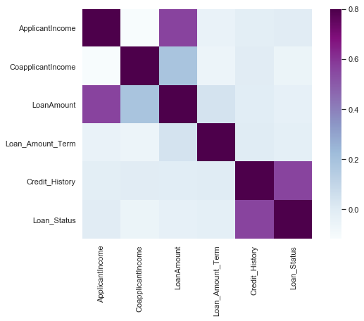


As expected, the most correlated variables are (ApplicantIncome - LoanAmount) and (Credit_History - Loan_Status).

## Missing Values and Outliers Treatment

From the previous analysis, the features with missing values were 'Gender','Married', 'Dependents', 'Self_employed', 'LoanAmount', 'Loan_Amount_Term' and 'Credit_History'.

So starting with the categorical features, a good way to replace **missing values** is using the Mode, which takes the most commom value in the column:


```python
train['Gender'].fillna(train['Gender'].mode()[0], inplace=True)
train['Married'].fillna(train['Married'].mode()[0], inplace=True) 
train['Dependents'].fillna(train['Dependents'].mode()[0], inplace=True) 
train['Self_Employed'].fillna(train['Self_Employed'].mode()[0], inplace=True) 
train['Credit_History'].fillna(train['Credit_History'].mode()[0], inplace=True)
```

The last feature now with missing values is the 'Loan_Amount_Term', so let's take a look at it's values:


```python
train['Loan_Amount_Term'].value_counts()
```


    360.0    512
    180.0     44
    480.0     15
    300.0     13
    84.0       4
    240.0      4
    120.0      3
    36.0       2
    60.0       2
    12.0       1
    Name: Loan_Amount_Term, dtype: int64


```python
train['Loan_Amount_Term'].fillna(train['Loan_Amount_Term'].mode()[0], inplace=True)
```

Checking now if there's any missing value


```python
train.isnull().sum()
```


    Loan_ID              0
    Gender               0
    Married              0
    Dependents           0
    Education            0
    Self_Employed        0
    ApplicantIncome      0
    CoapplicantIncome    0
    LoanAmount           0
    Loan_Amount_Term     0
    Credit_History       0
    Property_Area        0
    Loan_Status          0
    dtype: int64


Doing the same now for the test set:


```python
test['Gender'].fillna(train['Gender'].mode()[0], inplace=True) 
test['Dependents'].fillna(train['Dependents'].mode()[0], inplace=True) 
test['Self_Employed'].fillna(train['Self_Employed'].mode()[0], inplace=True) 
test['Credit_History'].fillna(train['Credit_History'].mode()[0], inplace=True) 
test['Loan_Amount_Term'].fillna(train['Loan_Amount_Term'].mode()[0], inplace=True)
test['LoanAmount'].fillna(train['LoanAmount'].median(), inplace=True)
```

**Taking care now of the outliers**

from the previous analysis the features 'LoanAmount' and 'ApplicantIncome' had a lot of outliers so it's necessary to remove them, because outliers often have a negative impact on the mean and standard deviation and hence affecting the distribution.

These outliers can make the data have a skewness to the right, and one way to remove this skewness is by doing a log transformation, because it doesn't affect the smaller values very much, but reduces the larger values. So, we get a distribution similar to normal distribution.


```python
train['LoanAmount_log'] = np.log(train['LoanAmount']) 
test['LoanAmount_log'] = np.log(test['LoanAmount'])

plt.subplot(121)
train['LoanAmount_log'].hist(bins=20) 
plt.title('Train Set Loan Amount Distribution')
plt.subplot(122)
plt.title('Test Set Loan Amount Distribution')
test['LoanAmount_log'].hist(bins=20, figsize = (15,5));
```


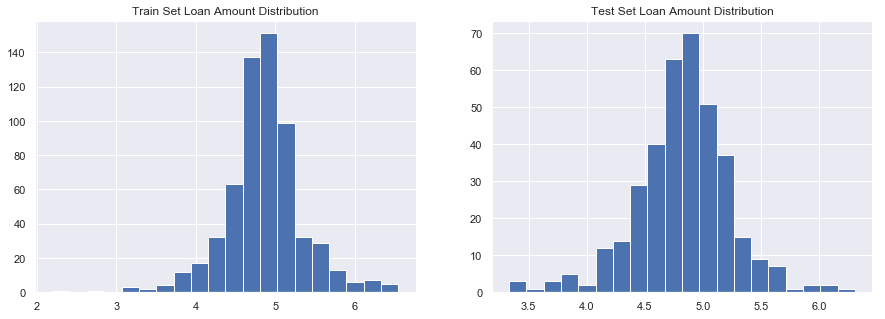


Now it looks much better and we're ready to start developing a predictive model on our dataset.

## Evaluation Metrics

Evaluation metrics are an essencial part of the model building process. Since this is a **classification problem**, we can evaluate our models using a confusion matrix, shown in Fig X:


<a>
    <div style="margin: 40px;">
        <p align="left">
            
            <h5 style="color:black;" align="center">Figure x - Confusion Matrix</h5>
        </p>
    </div>
</a>

In the correlation matrix, the elements have the following meaning:

* True Positive - Targets which are actually true (Y) and were predicted true (Y)
* True Negative - Targets which are actually false (N) and were predicted false (N)
* False Positive - Targets which are actually false (N) and were predicted true (T)
* False Negative - Targets which are actually true (T) and were predicted false (N)


**Accuracy**: Using the confusion matrix 


```python

```
